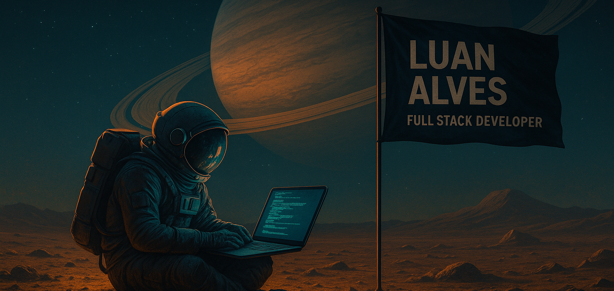

 
  ✌ Olá. Luan aqui! Eu sou Full Stack Developer e este é meu portfólio.

 

  ☕ Gosto de escrever código limpo, funcional e direto ao ponto — sem rodeios, igual meu café: forte e sem açúcar.

  🔍 Curioso por natureza, estou sempre fuçando novas techs, otimizando processos e automatizando o que der.

  🦄 Fique a vontade para visitar os projetos listados aqui e entrar em contato comigo.

  

  

  

