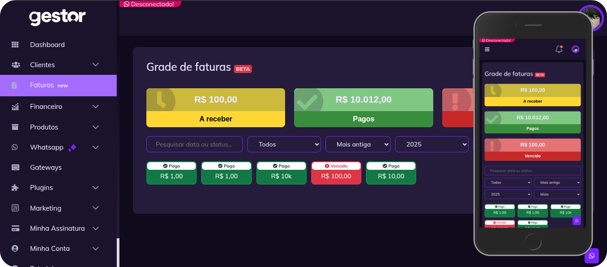
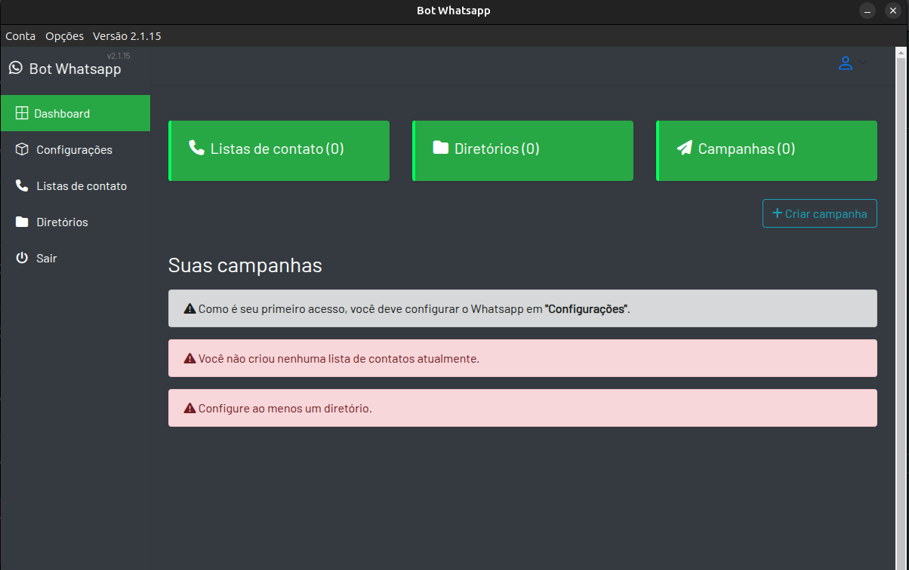
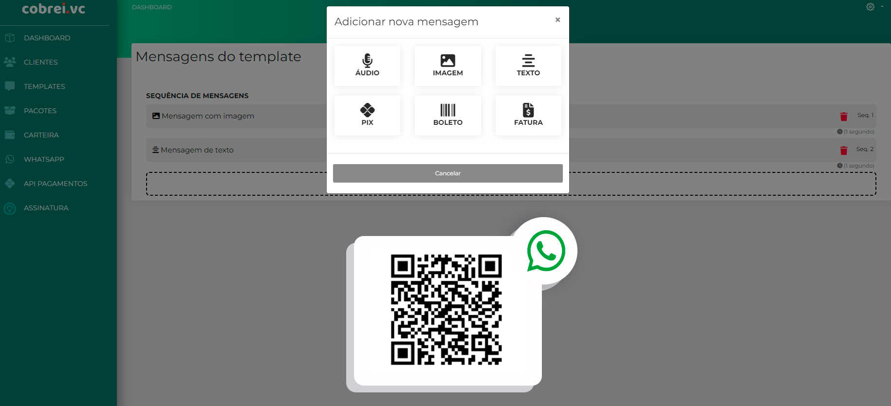
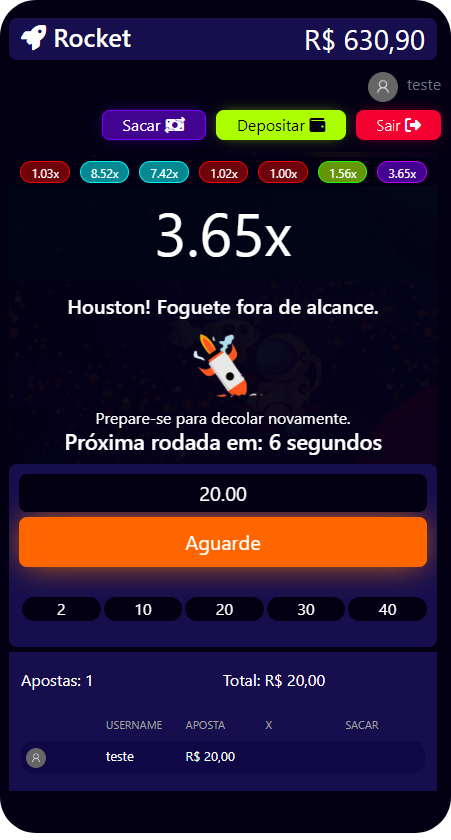

 
  🦄 Fique à vontade pra explorar os projetos e me chamar se quiser trocar ideia ou colaborar.

 

  

  

  

  

  PROJETOS

 

  

   Listtu – Gerenciador Avançado de Tarefas e Workspaces

    
    
     
    
    
    
   
  

  

  Listtu é uma aplicação completa de gerenciamento de times, tarefas e projetos, com foco em produtividade, colaboração e organização visual. Pensado para times reais, ele oferece recursos avançados com desempenho fluido, mesmo em dispositivos móveis.
  

  

  O Listtu foi projetado para ser modular, rápido e confiável, com atenção a detalhes visuais e comportamento realista para equipes que buscam produtividade sem complexidade desnecessária. Cada feature foi construída com lógica sólida e otimizações tanto no client quanto no backend.
  

  

    
    
  

 

  

   Gestor Lite – Controle financeiro, Cobranças automáticas através do whatsapp e email.

    
    
     
    
    
    
    
    
    
    
    
    
    
    

  
   
  

GestorLite é uma plataforma web robusta desenvolvida para provedores de internet, técnicos autônomos e empreendedores que precisam gerenciar clientes, planos, conexões, cobranças e automações de forma eficiente, centralizada e profissional.
  

  

GestorLite é voltado para gestão prática, rápida e segura, permitindo que pequenos provedores e negócios técnicos tenham controle total sem depender de soluções caras e engessadas. Tudo foi desenvolvido sob medida para ser funcional, leve e eficiente.
  

  

    <a href="https://gestorlite.com" >
      www.gestorlite.com
    </a>
  

 

  

   Bot Whatsapp para campanhas de marketing

    
    
    
    
    

  
   

O <strong>Bot WhatsApp 2.1.15</strong> é um software multiplataforma (Windows e Linux) desenvolvido em Electron. Seu objetivo é criar e gerenciar campanhas de envio automatizado no WhatsApp, com suporte completo para mídias como vídeos e imagens.

A dashboard é simples, intuitiva e funcional. Permite cadastrar listas de contatos separadas por nicho ou campanha, facilitando a segmentação. É possível selecionar pastas de mídia para definir quais arquivos serão enviados. O software é integrado à <strong>API Evolution</strong> para envio das mensagens, e conta com um sistema de atualização automática, permitindo a entrega de novas versões sem a necessidade de reinstalação manual.

 

  

   Cobrei.vc - Automatize suas cobranças

    
    
    
    
    
    
    
    
    
    
    

  
   

Cobrei.vc é uma plataforma web intuitiva desenvolvida para facilitar a gestão de cobranças recorrentes de forma simples, eficiente e acessível. Ideal para empreendedores, técnicos e prestadores de serviço que desejam automatizar o processo de faturamento e recebimento sem complicação.

Com foco total em praticidade, Cobrei.vc oferece uma experiência leve e direta, permitindo que qualquer usuário acompanhe faturas, pagamentos e inadimplências com facilidade. É a escolha certa para quem busca uma solução enxuta e funcional, sem abrir mão da organização e do controle financeiro.

  

    <a href="https://cobrei.vc" >
      cobrei.vc
    </a>
  

 

  

 

   Rocket - Jogo web

    
    
    
    
    

Rocket é um jogo simples desenvolvido em JavaScript, com foco em interatividade e lógica em tempo real.

O projeto foi criado e gravado, com o vídeo disponível <a href="https://youtube.com" target="_blank">no Youtube</a>. O jogo simula apostas com uma carteira digital, onde o usuário pode depositar valores e participar de rodadas. O objetivo é sacar o valor apostado antes que o foguete exploda. O sistema suporta múltiplos jogadores simultaneamente, com cada rodada sendo sincronizada em tempo real para todos os participantes via WebSocket.

  

    <a href="https://github.com/luannsr12/rocket/" >
      Código fonte
    </a>
    -
    <a href="https://www.youtube.com/watch?v=donoa-vxMac" >
        Vídeo completo no YouTube
    </a>
  

 

  

 Demais projetos:

- <a href="https://www.youtube.com/watch?v=Zojn_gkoakI" >Painel Entrega de produtos digitais automático Mercado Livre</a>
- <a href="https://www.youtube.com/watch?v=A9RuJh2CyZE" >Gerenciador de Grupos e Bots no Telegram</a>
- <a href="https://www.youtube.com/watch?v=KqSBx5K6_vI" >Painel entrega P2P automático por Whatsapp</a>
- <a href="https://github.com/luannsr12/api-correios" >API Rastreio Correios</a>
- <a href="https://github.com/luannsr12/menuia" >SDK Menuia Whatsapp</a>
- <a href="https://github.com/luannsr12/lance" >SDK Football Data</a>

