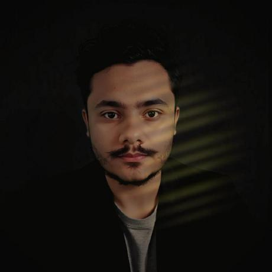

    

        
    

    

        <h1 style="margin-bottom:-10px;" >Luan Alves</h1>
        

        <em>Full Stack Developer | Backend Developer </em>
        

    

    <h3 style="text-align:center;font-weight:100;" >
    Bem-vindo ao meu portfólio! 
</h3>

  
  
  
  
  
  
  
  
  
  
  

  

  

Projetos em Destaque

- **[Sdk Correios](https://github.com/luannsr12/sdkcorreios)**: SDK Php para rastrear objetos dos correios.
- **[Jogo do foguetinho](https://github.com/luannsr12/rocket)**: Um jogo feito em Nodejs no estilo jogo de azar.
- **[SDK Sofascore](https://github.com/luannsr12/lance)**: SDK Php gratuita que usa API da Sofascore para futebol.

  

 

  <a href="https://github.com/luannsr12/">
  
  

  

  

  <em>Em caso de dúvida, meu caro amigo, sempre siga seu nariz</em>

